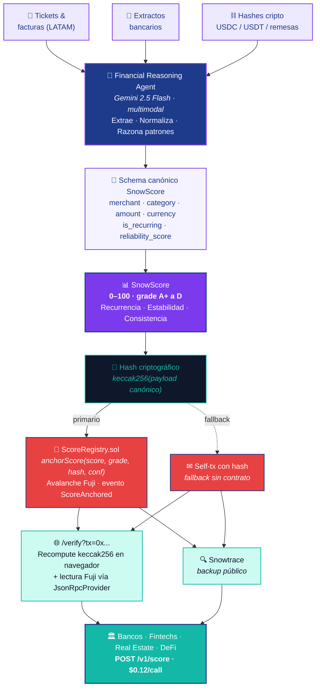

# SnowScore — Credit History API for the Invisible Generation

> *"Their receipts are the new credit bureau."*

SnowScore converts tickets, invoices, and bank statements into a standardized financial behavior score — certified on-chain on Avalanche and accessible via API to banks, fintechs, and lenders.

Built for the **Avalanche LatAm Institutional Hackathon 2026**.

**Live demo:** https://snowscore-709be.web.app
**User manual:** [MANUAL.md](./MANUAL.md)

---

## The Problem

In Latin America, **70% of young people and informal workers have no formal credit history**, even though they demonstrate payment capacity every month: rent, utilities, internet, groceries, transportation.

The traditional financial system marks them as "invisible":
- No payslip → no credit
- No credit card → no history
- No history → no access to housing, microcredit, or real financial inclusion

**The paradox is clear:** not having a credit card doesn't mean not having financial responsibility.

---

## The Solution

SnowScore is a **Financial Reasoning Agent** that transforms heterogeneous financial documents (receipts, invoices, bank statements) into a standardized credit score. On-chain anchoring on Avalanche is **optional** — institutions can consume the score even if the user has no wallet.

1. **Capture** — User uploads photos of tickets, utility bills, rent receipts, bank statements **and crypto transaction hashes** (USDC/USDT inflows, on-chain remittances)
2. **Reason** — Gemini 2.5 Flash (multimodal) extracts structured data and reasons about behavioral patterns (recurrence, stability, consistency)
3. **Score** — Calculates a SnowScore (0–100) and grade (A+ to D). Like snow accumulating, **the score is built by sustained patterns over time**, not by a single receipt — 12 months of paid rent weighs infinitely more than one isolated invoice.
4. **(Optional) Certify** — If the user has a wallet, the proof hash is anchored on Avalanche C-Chain via Core Wallet and routed through the `ScoreRegistry` contract (`anchorScore(score, grade, hash, confidence)` emitting the `ScoreAnchored` event). This makes the reputation portable and verifiable by any third party without asking SnowScore.
5. **Share** — Third parties query the score via REST API at $0.12/call and verify integrity on Snowtrace or via the in-app `/verify` page

---

## API

```bash
POST https://api.snowscore.xyz/v1/score
Authorization: Bearer sk_live_...

{
  "wallet": "0xA3f...8E2",
  "depth": "12_months"
}
```

```json
{
  "score": 87,
  "grade": "A-",
  "confidence": 0.94,
  "data_points": 142,
  "recurring_payments": 8,
  "avg_monthly_flow": 480000,
  "on_chain_proof": "0xb47f...c91a",
  "chain": "avalanche-c"
}
```

### Pricing

| Product | Price | Client |
|---------|-------|--------|
| Score lookup | $0.12 / call | Fintechs, quick scoring |
| Full report (12 months) | $0.85 / call | Banks, credit evaluation |
| Volume tier (>10k/month) | Custom | Enterprise |
| Sandbox / Testnet | Free | Developers |

---

## Standardized Schema

Every document is normalized to a single JSON schema:

```json
{
  "doc_type": "receipt | bank | crypto",
  "merchant": "string",
  "category": "utilities | groceries | rent | food | transport | education | health | telecom | income | transfer | other",
  "category_label": "string in Spanish",
  "amount": 42380,
  "currency": "ARS",
  "date": "2026-04-10",
  "is_recurring": true,
  "recurrence_pattern": "monthly",
  "payment_behavior_signal": "Pago puntual de servicio esencial con patrón mensual estable",
  "reliability_score": 91,
  "items_summary": "Factura de electricidad Edenor — período abril 2026",
  "datapoints_extracted": 8
}
```

---

## Brand System

| Token | Value | Usage |
|-------|-------|-------|
| `--deep-blue` | `#1E3A8A` | Logo, titles, institutional elements |
| `--violet` | `#7C3AED` | AI, innovation, CTAs, gradient |
| `--light-blue` | `#3B82F6` | Interfaces, icons, secondary info |
| `--turquoise` | `#14B8A6` | Score, metrics, positive states |
| `--lavender` | `#EDE9FE` | Cards, soft backgrounds |
| Official gradient | `#1E3A8A → #7C3AED → #14B8A6` | Score card, CTA buttons |

**Primary font:** Poppins (400/500/600/700/800) — geometric, clean, accessible
**Technical font:** JetBrains Mono (400/500/700) — code, API, metadata

### Brand assets

| Asset | Path | Size |
|-------|------|------|
| Logo | `brand/logo.svg` | 512×512 |
| Cover | `brand/cover.svg` | 840×300 |

**Concept:** The logo is a six-pointed snowflake (Snow / Avalanche) with a hexagonal block at its center (blockchain certification), rendered in the official gradient. It carries the brand idea: *consumer behavior becomes verifiable on-chain identity*.

---

## Tech Stack

| Layer | Technology | Notes |
|-------|-----------|-------|
| Frontend | HTML + CSS + JS vanilla | Single-file, deployable to any static host |
| Fonts | Poppins · JetBrains Mono | Via Google Fonts CDN |
| AI | Gemini 2.5 Flash | Multimodal vision + JSON mode |
| Auth | Mock (any email works) | No real backend |
| Blockchain | Avalanche C-Chain Fuji | Real self-tx anchoring via ethers.js v6 + Core Wallet |
| Hosting | Firebase Hosting | Live at `snowscore-709be.web.app` |

### Why Avalanche
- **Sub-second finality** → reputation as fluid as cash
- **Low gas costs** → economically viable for LATAM users
- **Subnets/L1s** → future dedicated subnet for financial identity
- **Mature DeFi ecosystem** → natural integration with lending protocols

---

## Value Flow

End-to-end flow from a user's invisible financial activity to a verifiable on-chain credit score consumed by institutions.



**Two key insights:**

1. **Why "Snow"Score → time is the primitive.** Just like a snowfall: a single flake doesn't matter, the layer accumulated over months does. Each datapoint is weighted by how long the user has sustained the pattern (12 months of paid rent ≫ a one-off invoice). Recency, recurrence, and consistency are the three dimensions that compound into the score — not the absolute amount of any single transaction.

2. **The hash is deterministic.** Anyone holding the canonical payload can recompute `keccak256(JSON.stringify(payload))` locally and verify it matches what was anchored on Avalanche — **no trust in SnowScore required**. The `/verify` page does exactly this in the browser of the institution consuming the score.

> **Wallet is optional.** A user without a wallet still gets a SnowScore consumable via API. The wallet only adds **portability** (the user owns the proof) and **third-party verifiability** (anyone can check Snowtrace). For unbanked LATAM users, the score works before they ever touch crypto.

---

## Running Locally

No build steps. Just open the file:

```bash
# Option 1 — direct
open index.html

# Option 2 — local server
npx serve . --listen 3000
```

Then navigate to `http://localhost:3000`, click **Get Started**, and use any email/password to log in.

To analyze a document, you'll need a [Gemini API key](https://aistudio.google.com/apikey) (free tier works).

---

## Use Cases

- **Microcredit fintechs** — Grant loans to users without bank history with confidence
- **Property rentals** — Landlords verify solvency without requesting payslips
- **DeFi protocols** — Enable under-collateralized loans using on-chain reputation
- **Education / scholarships** — Verify family economic stability
- **E-commerce / BNPL** — Quick evaluation for "buy now pay later"

---

## Roadmap

### Now — Shipped at the Avalanche LatAm Hackathon
Full vertical slice of the SnowScore protocol, live in production:
- **Multimodal Financial Reasoning Agent** (Gemini 2.5 Flash) that standardizes tickets, bank statements and crypto inflows into a single canonical schema
- **SnowScore engine** (0–100 + grade A+/D) weighted by recurrence, stability and consistency over time
- **`ScoreRegistry` contract on Avalanche** with `anchorScore()` + `ScoreAnchored` event — score becomes a portable, third-party-verifiable artifact
- **`/verify` page** with browser-side `keccak256` recompute — institutions audit the proof without trusting SnowScore
- **Institutional UX**: live API demo, FAQ for risk teams, use-case grid for Bankaool / Arkangeles / LATAM fintechs
- **Demo mode "María Pérez"** for one-click jury walkthrough

### Q3 2026 — Pilot wave
- First **production pilots** with 2–3 LATAM partners (microcredit, real estate, BNPL)
- **Official SDK** for Node, Python and Java
- **Backend API gateway** with org-level auth, rate limiting and per-call billing
- **Webhook integration** with core banking systems (Galicia, Mercado Pago, Naranja X)

### Q4 2026 → 2027 — Institutional layer
- **Dedicated Avalanche L1** for financial identity (sub-second finality, sovereign rules per jurisdiction)
- **Regulatory certifications** by country: BCRA & CNV (Argentina), CNBV (México), SFC (Colombia), BACEN (Brasil)
- **Cross-chain identity bridges** so a SnowScore minted on Avalanche is consumable from any EVM lending protocol
- **Underwriting marketplace**: lenders bid in real-time on qualified users who opt-in to share their score

### 2027 → beyond — The trust layer for the invisible economy
- Coverage across all major LATAM economies, then Africa and South-East Asia
- **Open protocol**: any institution can issue contributions to a user's score (rent, telecom, education) → SnowScore becomes the reference layer for trust in the unbanked economy

---

## Business Model

SnowScore is **free for end users**. We monetize by charging institutions that consume the API.

> We don't monetize the vulnerable user — we charge the institutions that need the data.

---

*SnowScore — The trust layer the invisible economy was missing.*

Built by [Cesar Riat](https://cesarriat.com) · Powered by Gemini · Anchored on Avalanche
